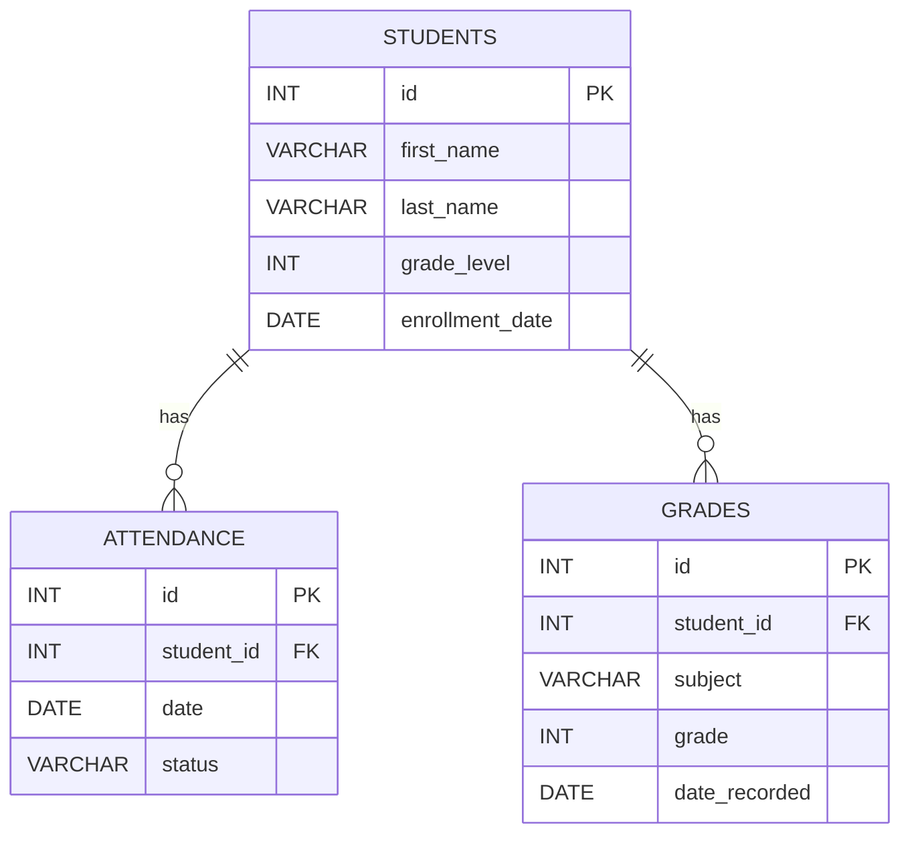

#  Student Success Tracker

`https://img.shields.io/badge/PHP-8.0-blue`
`https://img.shields.io/badge/MySQL-Database-orange`
`https://img.shields.io/badge/XAMPP-Localhost-critical`
`https://img.shields.io/badge/Status-Active-success`
`https://img.shields.io/badge/License-MIT-green`

---

## Features
- Add and manage student records  
- Track attendance across multiple dates  
- Record and view student grades  
- View full student profiles  
- Generate performance analytics (GPA, attendance rate, grade trends)  
- JSON API endpoints for dashboards  
- Clean, simple, and beginner‑friendly PHP structure  
- MySQL database integration (XAMPP‑ready)

---

## Application Pages

### **index.php**  
Home page showing all students.

### **add_student.php**  
Form to add new students.

### **edit_student.php**  
Edit existing student information.

### **update_student.php**  
Processes student updates (secure prepared statements).

### **delete_student.php**  
Deletes a student (secure prepared statements).

### **student.php**  
Full student profile page.

### **attendance.php**  
View and manage attendance records.

### **grades.php**  
View and manage student grades.

### **analytics.php**  
Visual charts and insights powered by Chart.js (optional).

---

## Installation

1. Clone or download the project  
2. Move it into your XAMPP `htdocs` folder  
3. Import the SQL file into phpMyAdmin  
4. Update `includes/db.php` with your database credentials  
5. Start Apache + MySQL  
6. Visit:  
   ```
   http://localhost/student-success-tracker/
   ```

---

## Technologies Used
- **PHP** (Core application logic)  
- **MySQL** (Database)  
- **HTML/CSS** (UI layout and styling)  
- **JavaScript** (Search filter + API usage)  
- **Chart.js** (Optional analytics visualizations)  
- **XAMPP** (Local development environment)

---

## Analytics (Chart.js)

This page provides visual insights such as:

- Attendance trends  
- Grade distribution  
- GPA  
- Skill trend (Improving / Declining / Stable)  
- Performance summary  
- Dynamic, responsive charts powered by Chart.js  

---

## Project Structure

```
student_success_tracker/
│
├── index.php
├── add_student.php
├── edit_student.php
├── update_student.php
├── delete_student.php
├── student.php
├── attendance.php
├── grades.php
├── analytics.php
│
├── includes/
│   ├── db.php
│   ├── header.php
│   ├── footer.php
│   ├── calculations.php
│
├── api/
│   ├── get_gpa.php
│   ├── get_performance_summary.php
│   ├── get_grades.php
│   ├── get_attendance.php
│
└── assets/
    ├── styles.css
    ├── scripts.js
```


## Database Schema (ERD)



---

## License

This project is licensed under the MIT License.

Copyright (c) 2026

Permission is hereby granted, free of charge, to any person obtaining a copy  
of this software and associated documentation files (the “Software”), to deal  
in the Software without restriction, including without limitation the rights  
to use, copy, modify, merge, publish, distribute, sublicense, and/or sell  
copies of the Software, and to permit persons to whom the Software is  
furnished to do so, subject to the following conditions:

The above copyright notice and this permission notice shall be included in  
all copies or substantial portions of the Software.

THE SOFTWARE IS PROVIDED “AS IS”, WITHOUT WARRANTY OF ANY KIND, EXPRESS OR  
IMPLIED, INCLUDING BUT NOT LIMITED TO THE WARRANTIES OF MERCHANTABILITY,  
FITNESS FOR A PARTICULAR PURPOSE AND NONINFRINGEMENT. IN NO EVENT SHALL THE  
AUTHORS OR COPYRIGHT HOLDERS BE LIABLE FOR ANY CLAIM, DAMAGES OR OTHER  
LIABILITY, WHETHER IN AN ACTION OF CONTRACT, TORT OR OTHERWISE, ARISING  
FROM, OUT OF OR IN CONNECTION WITH THE SOFTWARE OR THE USE OR OTHER  
DEALINGS IN THE SOFTWARE.

---
// Updated commit history